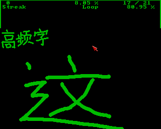
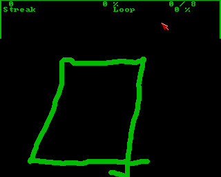

Do you know that the quickest [input methods](https://en.wikipedia.org/wiki/Chinese_input_methods_for_computers) for [Chinese characters](https://en.wikipedia.org/wiki/Chinese_characters) are based on the character components? They are a viable alternative to the pronunciation-based approach followed by the [Pinyin (拼音) input method](https://en.wikipedia.org/wiki/Pinyin_input_method). But they require memorization of *100* to *200* components.

This *quiz* game flattens the learning curve by training your reflexes based on visual input. A component is shown and you type the key which is assigned to it.

There are two game modes based on the input method you want to learn:
* **[Wubi Zixing (五笔字型)](https://en.wikipedia.org/wiki/Wubi_method):** Input method for [simplified characters](https://en.wikipedia.org/wiki/Simplified_Chinese_characters).
* **[CangJie (倉頡)](https://en.wikipedia.org/wiki/Cangjie_input_method):** Input method for [traditional characters](https://en.wikipedia.org/wiki/Cangjie_input_method).

In one run, you need to give the correct answer once for each component. This means that the component is asked again if the answer was wrong.

# How to Use

Put the repository into a mounted directory of an *emulated* [Amiga 500](https://en.wikipedia.org/wiki/Amiga_500) and run the start script (assuming that AmigaBASIC is installed in mounted `Basic`):
```
execute HanziInputQuiz
```

You can also start using the workbench (`info`-files provided).

Alternatively, you can open the source file in your [AmigaBASIC](https://en.wikipedia.org/wiki/Amiga_Basic), but be sure to reside in the `src` library.

# Trivia

* *Assembly subroutines:* The game is significantly sped up by using dedicated [Assembly](https://en.wikipedia.org/wiki/Assembly_language) subroutines. Their sources are found [here](https://github.com/phoyh/misc-asm-68k-amiga-ocs).
* *Data files:* The components were hand-drawn and saved as [IFF](https://en.wikipedia.org/wiki/Interchange_File_Format) images. The file name makes the connection to the corresponding key.

# Gallery

|  |
| :--: |
| Wubi Zixing quiz mode. This is one <br> of the *25* high frequency characters. |

|  |
| :--: |
| CangJie quiz mode. This component <br> does not exist for WuBi. |
